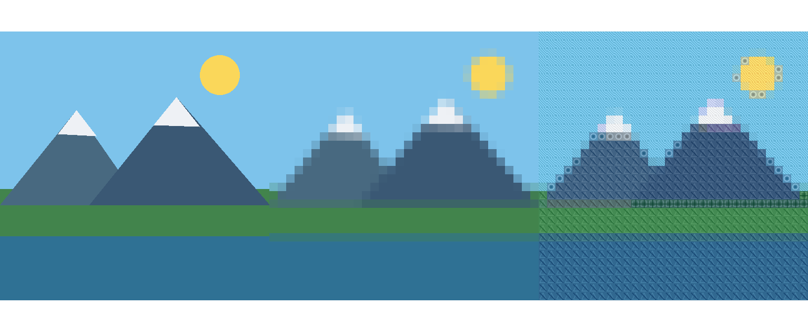
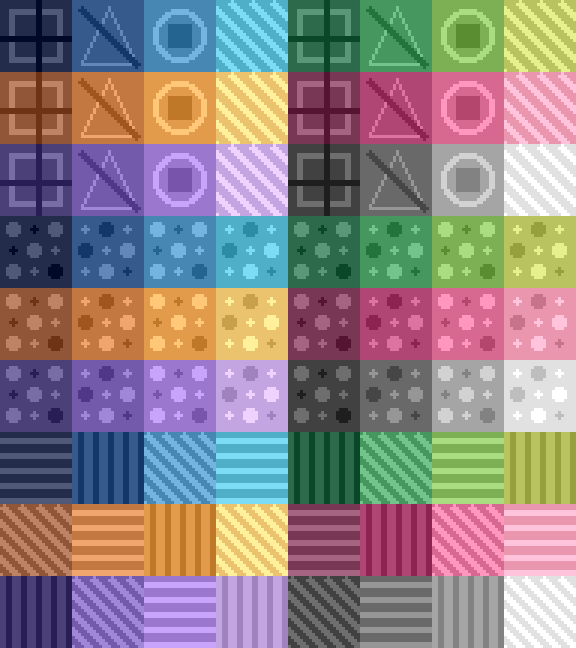

# Interactive Image Mosaic Generator

An interactive image-processing project that segments an uploaded image into a grid and reconstructs it using representative mini-image tiles. The implementation emphasizes vectorized NumPy operations, measurable reconstruction quality, performance analysis, and an easy-to-use Gradio demo.



## Features

- Upload any image and center-crop/resize it to a fixed **512×512** working resolution.
- Choose **16×16, 32×32, or 64×64** grid resolution.
- Choose among **three predefined tile sets**: Geometric, Dots, and Stripes.
- Choose **Natural, Colorized, or High Contrast** rendering styles.
- Compute cell-average RGB values with a **vectorized NumPy** implementation.
- Classify cells into readable color categories: Red, Orange, Yellow, Green, Cyan, Blue, Purple, and Neutral.
- Map each grid cell to its closest tile using squared Euclidean distance in RGB space.
- Display the **original/preprocessed image**, **segmented color grid**, and **final mosaic** side by side.
- Evaluate reconstruction quality with **MSE** and **SSIM**.
- Compare **vectorized NumPy vs. nested-loop** implementations at 16×16, 32×32, and 64×64.
- Includes three built-in example images and automated tests.

## Tile sets



Each tile set contains 24 mini-images spanning a broad color palette. The tile art is generated deterministically, so the application is fully self-contained and does not depend on external assets or network calls.

## How it works

1. **Preprocess** - center-crop the uploaded image to square and resize it to 512×512.
2. **Segment** - divide the image into a fixed grid of 16×16, 32×32, or 64×64 cells.
3. **Analyze** - compute the mean RGB value of every cell using a single vectorized reshape/reduction.
4. **Classify** - assign each cell to a descriptive color category for analysis.
5. **Match** - compare every cell mean to the precomputed mean color of every tile and choose the closest match.
6. **Reconstruct** - resize and place the selected mini-image into each corresponding grid cell.
7. **Evaluate** - compute MSE and SSIM between the preprocessed input and reconstructed mosaic.
8. **Benchmark** - time both the vectorized and nested-loop cell-analysis implementations and report the scaling difference.

## Performance

Reference benchmark on the included `examples/landscape.png` image:

| Grid | Cells | Vectorized | Nested loop | Speedup |
| --- | ---: | ---: | ---: | ---: |
| 16×16 | 256 | 4.512 ms | 5.635 ms | 1.25× |
| 32×32 | 1,024 | 4.645 ms | 8.583 ms | 1.85× |
| 64×64 | 4,096 | 5.335 ms | 21.108 ms | 3.96× |

The loop implementation scales more sharply because Python processes every cell separately. The vectorized method keeps the reduction inside optimized NumPy operations, so the performance advantage becomes larger as grid resolution increases.

For the 32×32 Geometric/Colorized example, one reference run produced **MSE 439.40** and **SSIM 0.2101**. Exact timings and quality values vary by image and machine, so the live app calculates them on demand.

## Run locally

```bash
python -m venv .venv
source .venv/bin/activate  # Windows: .venv\Scripts\activate
pip install -r requirements.txt
python app.py
```

Then open the local Gradio URL printed in the terminal.

## Run the tests

```bash
pip install -r requirements-dev.txt
pytest -q
```

The final test suite contains **9 automated tests** covering preprocessing, all three grid sizes, vectorized/loop equivalence, all tile sets and styles, valid MSE/SSIM output, color-category accounting, benchmark structure, tile-sheet generation, example generation, and complete end-to-end processing.

## Project structure

```text
interactive-image-mosaic/
├── app.py
├── README.md
├── PERFORMANCE_REPORT.md
├── performance_report.pdf
├── requirements.txt
├── requirements-dev.txt
├── LICENSE
├── examples/
│   ├── gradient.png
│   ├── landscape.png
│   └── portrait.png
├── screenshots/
│   ├── sample_output.png
│   └── tile_sets.png
├── scripts/
│   └── generate_assets.py
├── tests/
│   ├── conftest.py
│   └── test_app.py
└── .github/workflows/
    ├── generate-assets.yml
    ├── sync-to-huggingface.yml
    └── tests.yml
```

## Requirement coverage checklist

| Assignment requirement | Implementation |
| --- | --- |
| Test images and preprocessing | Three included examples; center-crop and resize to 512×512 |
| Fixed-grid segmentation | 16×16, 32×32, and 64×64 options |
| Vectorized cell analysis | NumPy reshape + mean across all grid cells |
| Color classification | Red, Orange, Yellow, Green, Cyan, Blue, Purple, Neutral |
| Predefined tile set | Three deterministic 24-tile sets |
| Cell-to-tile mapping | Nearest average RGB using squared Euclidean distance |
| Gradio interface | Upload, grid selector, tile-set selector, rendering-style selector |
| Original / segmented / mosaic views | All three displayed side by side |
| Similarity evaluation | MSE and SSIM |
| Performance analysis | Median timing at 16×16, 32×32, 64×64 |
| Vectorized vs. loop comparison | Both implementations included and benchmarked |
| Creativity | Multiple tile sets and three rendering styles |
| Live demo | Hugging Face Space deployment |
| Performance report | Markdown and formatted PDF |
| Reproducibility | Pinned dependencies, automated tests, CI, deployment workflow, reproducible asset generator |

## Assignment coverage

This project includes image preprocessing, fixed-grid segmentation, vectorized cell analysis, color categorization, a predefined tile set, cell-to-tile matching, Gradio controls for grid size and tile set, original/segmented/final presentation, MSE and SSIM evaluation, performance timing for 16×16/32×32/64×64, and a direct vectorized-vs-loop comparison.

A formatted 1–2 page performance report is included as `performance_report.pdf`.
